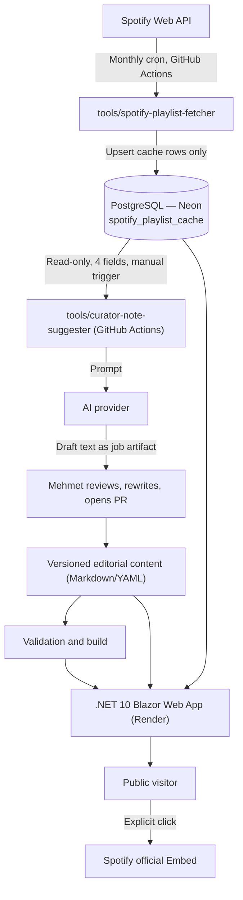

# TheBluesland — Business & Technical Specification

**Version:** 0.2
**Date:** 2 September 2026
**Status:** Draft — implementation has not started
**Repository:** GitHub, public
**Owner / curator:** Mehmet Oya
**Supersedes:** `docs/business-technical-specification.v0.1.md` (kept for historical reference; do not implement against it)
**Amended:** 3 September 2026 — the absolute "no Spotify Content to AI/ML, no exception" rule was
deliberately narrowed by the owner: four playlist-level `spotify_playlist_cache` fields may now be
used as AI input for curator-note *suggestions* only, output is always a draft, and the AI provider
key never enters production. See `docs/adr/0005-ai-kurator-notu-siniri.md`; affected sections: 3.2,
3.3, 9.4, 10.3, 11.1, 11.2, 13 (SEC-001, SEC-008), 17, 18.5, 20 (V1.2), 21, 24.

---

> **Architecture note — read before implementation.**
> This repository also contains a generic multi-client `.NET` technology contract
> (`.claude/CLAUDE.md`) and a generic `docs/adr/0001-platform-secimi.md`, both describing
> an API-first architecture with separate `src/Api`, `src/Domain`, `src/Infra`, `src/Shared`,
> `src/Ui.Shared`, `src/Web` (Blazor WASM) and `src/Mobile` (MAUI) projects. **TheBluesland does
> not use that template.** TheBluesland is a single .NET 10 Blazor Web App (static SSR with
> isolated Interactive Server islands) plus one small shared persistence library consumed by an
> out-of-process sync tool — there is no separate API host, no MAUI client and no mobile target.
> This is a deliberate, scoped decision, not an oversight. Rationale and consequences are recorded
> in `docs/adr/0003-mimari-kapsam.md`. **This deviation from the repository's default template
> requires Mehmet's explicit sign-off before implementation begins.**

---

## 1. Executive summary

TheBluesland is a public, editorial playlist showcase for Spotify playlists curated by Mehmet
Oya. It is not intended to reproduce Spotify or provide a new music catalogue. Its independent
value is the human curation around each playlist: why it exists, which mood and setting it fits,
and what kind of listening experience it offers.

Visitors will browse and filter playlists by mood, genre, occasion and era, read Mehmet's curator
notes, and listen through Spotify's official Embed player or continue in Spotify.

The MVP architecture is **hybrid**. Editorial content — moods, genres, occasions, era, curator
notes and slugs — remains version-controlled Markdown/YAML in the GitHub repository, edited by
hand through pull requests, exactly as in v0.1. Separately, TheBluesland now integrates directly
with the Spotify Web API to fetch a narrow set of Spotify-owned facts about each playlist — its
name, description, cover image URL, track count and contributing artist list — and caches them in
a PostgreSQL database. This cache is refreshed once a month by a scheduled GitHub Actions job, not
by the running web application. The two data sources are joined at read time by
`spotifyPlaylistId`. The individual track listing is never persisted; it is fetched transiently
during sync solely to compute a track count and artist list, then discarded.

This reverses one of v0.1's core assumptions (no database, no Spotify Web API) while preserving
its others: no visitor accounts, no automated inference of mood/genre from Spotify content, and a
click-to-load Spotify Embed for playback. One further v0.1 assumption was deliberately narrowed on
3 September 2026: AI may now be given four playlist-level cache fields (`name`, `description`,
`track_count`, `artists`) to draft a *suggested* curator note for Mehmet's own review. Track-level
data, cover art and model-side retrieval of Spotify URLs remain forbidden, AI output is never
published automatically, and the production web application still holds no Spotify or AI
credential — those live only in GitHub Actions repository secrets, isolated to the sync job and the
manually triggered suggestion job (section 11.2, SEC-008, ADR-0005).

Hosting is Render (web, free tier) + Neon (Postgres, free tier) + GitHub Actions (scheduled sync),
targeting $0/month operating cost.

---

## 2. Product vision

### 2.1 Vision statement

> TheBluesland is a personal music cabinet where every playlist has a mood, a story and a reason
> to be played.

### 2.2 Product promise

The visitor should be able to answer three questions within seconds:

1. What kind of playlist is this?
2. When or in which mood should I listen to it?
3. How can I start listening on Spotify?

### 2.3 Independent value

TheBluesland adds value beyond the Spotify player through:

- Original curator notes written by Mehmet.
- A consistent mood, genre, occasion and era taxonomy.
- Editorial collections and featured selections.
- A focused, personal visual identity.
- Shareable and searchable playlist detail pages.

---

## 3. Goals and success criteria

### 3.1 MVP goals

- Publish a fast, responsive and publicly accessible playlist showcase.
- Let visitors filter playlists by editorial tags without signing in.
- Give every playlist a permanent, shareable detail URL.
- Keep editorial playlist management simple enough to perform through a GitHub pull request.
- Keep Spotify-owned facts (name, description, cover image, track count, artists) fresh without
  manual re-entry, via a monthly automated sync rather than hand-copying.
- Use Spotify's official Embed rather than reproducing playlist contents.
- Establish a clean .NET codebase suitable for continued development in a public repository.

### 3.2 Initial success criteria

- At least 8 editorially completed playlists at public launch.
- Every published playlist has a curator note and at least one mood, genre and occasion tag.
- Core pages achieve Lighthouse targets defined in section 15.
- A new playlist's *editorial* content can be added without a database migration or
  application-code change; its Spotify-owned facts appear automatically after the next monthly
  sync.
- CI rejects invalid or incomplete playlist content.
- **The production web application requires no Spotify credential and no AI provider key.** It
  holds only a Postgres (Neon) connection string. Spotify credentials, the sync job's database
  credential and the AI provider key exist exclusively as GitHub Actions repository secrets, each
  scoped to its own workflow (see section 13, SEC-001).

### 3.3 Non-goals for MVP

- Persisting individual Spotify track titles, track IDs, durations or audio-feature data, in the
  database or in content files, under any retention period. (Track data is read transiently during
  monthly sync solely to derive a track count and artist list; it is never written to storage. See
  section 11.2.)
- Automatically inferring mood, genre, tempo, energy or valence from Spotify content.
- Sending track-level Spotify data (track titles, IDs, durations, ISRCs, audio features),
  cover-art image data, or any Spotify URL for model-side retrieval to an AI/ML model, and using
  any Spotify Content for model training. (Narrowed on 3 September 2026: four playlist-level cache
  fields may be used as AI *inference* input for a curator-note suggestion that a human must review
  — section 11.2, SEC-008, ADR-0005.)
- Publishing any AI-generated text without Mehmet's review; AI output never enters
  `content/playlists/*.md` automatically and is never published as `status: published` by a machine.
- Recommending individual tracks.
- Visitor login, profiles or saved favourites.
- Comments, reactions, ratings or voting.
- Allowing other users to submit their playlists.
- Editing Spotify playlists from TheBluesland.
- Full-text track or artist search.
- A native mobile application (see the architecture note above and ADR-0003).
- Monetisation or advertising.
- Real-time or on-demand Spotify lookups from the production web app (all Spotify Web API access
  is confined to the monthly sync job — see section 12).
- Any AI call from the production web application (all AI access is confined to a manually
  triggered GitHub Actions workflow — section 18.5).

---

## 4. Target audience and use cases

### 4.1 Primary audience

Music listeners who trust personal curation and want a playlist appropriate for a particular mood,
time or setting.

### 4.2 Secondary audience

- People arriving from Mehmet's blog or social media posts.
- Blues, rock, soul, jazz and adjacent-genre listeners.
- Recruiters and developers viewing the project as a public .NET portfolio repository.

### 4.3 Core user journeys

#### Journey A — Browse by mood

1. Visitor lands on the home page.
2. Visitor selects one or more mood filters.
3. Matching playlist cards remain visible.
4. Visitor opens a playlist detail page.
5. Visitor reads the curator note and loads the Spotify player.

#### Journey B — Arrive through a shared link

1. Visitor opens a playlist detail URL from social media.
2. The page immediately communicates the playlist's character and intended setting.
3. Visitor chooses either "Listen here" or "Open in Spotify".

#### Journey C — Explore related playlists

1. Visitor finishes reviewing one playlist.
2. The page displays up to three related playlists based on shared editorial tags.
3. Visitor continues browsing without returning to the home page.

---

## 5. Information architecture

| Route | Purpose | Rendering |
| --- | --- | --- |
| `/` | Brand introduction, featured playlists, complete catalogue and filters | Static SSR + interactive filter island |
| `/playlists/{slug}` | Curator note, editorial tags, Spotify-sourced facts, Spotify Embed and related playlists | Static SSR |
| `/collections/{slug}` | Editorial grouping such as "Late Night Blues" | Static SSR; optional for launch |
| `/about` | Mehmet's curation approach and TheBluesland story | Static SSR |
| `/privacy` | Privacy and Spotify Embed disclosure | Static SSR |
| `/terms` | Site terms and Spotify attribution/disclaimer | Static SSR |
| `/sitemap.xml` | Search-engine discovery | Server-generated |
| `/robots.txt` | Crawler policy | Static |
| `/feed.xml` | Newly published playlist feed | Server-generated; optional for launch |

There will be no `/login`, `/admin` or public API route in the MVP.

---

## 6. MVP functional requirements

### 6.1 Catalogue and cards

**FR-001 — Playlist catalogue**
The home page must list every published playlist ordered by `displayOrder`, then by
`publishedAt` descending.

**FR-002 — Playlist card**
Each card must display the title, short summary, primary mood, primary genre, optional era and a
clear detail-page link.

**FR-003 — Featured playlists**
The home page must support a manually curated featured section. A maximum of four playlists may
be featured at once.

**FR-004 — Empty state**
If no playlists match the active filters, the page must explain this and offer a one-action filter
reset.

**FR-005 — Cache-backed metadata display**
A card may display Spotify-sourced facts (track count, cover image) read from the database cache.
If no cache row exists yet for a published playlist's `spotifyPlaylistId` (e.g. it has not
completed its first sync), the card must still render correctly using editorial fields alone,
without an error state or missing-image placeholder that looks broken.

### 6.2 Filtering

**FR-010 — Filter dimensions**
Visitors must be able to filter by mood, genre, occasion and era.

**FR-011 — Filter combination**
Values inside the same dimension use OR logic. Different dimensions use AND logic.

Example: `mood = calm OR melancholic` together with `occasion = night-drive` returns playlists
that match at least one selected mood and the selected occasion.

**FR-012 — Shareable state**
Active filters must be represented in the query string so filtered views can be shared and browser
navigation works correctly.

**FR-013 — Progressive enhancement**
Catalogue browsing and playlist detail pages must remain usable when JavaScript or the interactive
Blazor connection is unavailable. Instant client interaction may degrade to a normal page request.

### 6.3 Playlist detail

**FR-020 — Stable URL**
Each playlist must have a unique immutable slug after publication. A changed slug requires a
permanent redirect from the previous slug.

**FR-021 — Curator note**
The detail page must display an original curator note written by Mehmet. The recommended length
is 80–250 words.

**FR-022 — Spotify listening actions**
The page must provide:

- A click-to-load Spotify Embed.
- A visible "Open in Spotify" link.
- Clear Spotify attribution.

**FR-023 — Related playlists**
The page must display up to three published playlists with the strongest overlap in manually
assigned tags. The current playlist must never be included.

**FR-024 — Missing or unsynced playlist (revised for hybrid architecture)**
The application never calls Spotify live on a visitor request; availability is known only from the
last monthly sync. If the cache marks a playlist `is_available = false` (the last sync could not
find it on Spotify), or if no cache row exists at all, TheBluesland must continue displaying its
editorial page and show a graceful player-unavailable message alongside the "Open in Spotify" link
(which may itself fail if the playlist is gone). It must not expose a broken iframe as the only
content. This detection has up to one month of lag by design; that lag is an accepted trade-off
(see section 21, Risks).

**FR-025 — Spotify-sourced fields on the detail page**
When a cache row exists and `is_available = true`, the detail page may show the Spotify-owned
track count and cover image (subject to FR-031: cover image is never used for the site's own
social/OG card) alongside the editorial content. These fields are informational only and are never
treated as authoritative for editorial classification.

### 6.4 Sharing and discovery

**FR-030 — Metadata**
Every indexable page must have a unique title, description, canonical URL, Open Graph metadata and
Twitter/X card metadata.

**FR-031 — Social image**
Playlist pages must use a TheBluesland-owned social card rather than downloading or permanently
copying Spotify cover art, even though the cover image URL is present in the database cache.

**FR-032 — Structured data**
The site must emit valid `WebSite`, `CollectionPage` and `BreadcrumbList` schema where applicable.
The MVP must not publish a copied track list in structured data — the database never contains one
to copy from (section 9.4).

---

## 7. Initial content inventory

The supplied links contain two unique public playlist identifiers. The first link was provided
twice.

| Spotify playlist ID | Editorial title (draft) | Mood/genre tags (draft) | Curator note | Status |
| --- | --- | --- | --- | --- |
| `0iJt9LMebhOY0KSHSJw3cS` | "Masterpieces of Erkin the Father" (Erkin Koray, Anadolu rock) | moods: `energetic`, `raw`; genres: `anadolu-rock`, `rock` | TBD by Mehmet | Candidate |
| `2m8X8fsMWor8A5AnmOHwzy` | "Dear Mr. Fantasy" (Clapton / Winwood / Traffic, blues rock) | moods: `warm`, `nostalgic`; genres: `blues-rock`, `rock` | TBD by Mehmet | Candidate |

The title and tag columns above are **product-owner drafts to unblock scaffolding and taxonomy
design, not approved editorial content.** Mehmet must confirm or replace the title, summary, tags
and curator note for both before publication (see section 23, item 3, still open).

No title, genre or mood will be inferred automatically from Spotify content; the draft tags above
were assigned by a human (product owner) reading the playlist name and genre context, not by any
automated or AI process. Automated taxonomy assignment remains prohibited (section 11.2) — the
narrowed AI allowance of ADR-0005 covers curator-note prose suggestions only, never tags.

### 7.1 Launch content requirement

The recommended public launch threshold is eight completed playlists. Development may begin with
the two candidates above, but the home-page design must be evaluated again with at least eight
realistic entries before release.

---

## 8. Editorial taxonomy

The taxonomy is owned by TheBluesland and must be manually assigned. Values are stable
identifiers; display labels may later be localised.

### 8.1 Taxonomy width — resolved

v0.1 proposed 10 moods × 11 genres × 10 occasions × 9 eras. With a launch target of only 8
playlists, most combinations of that grid would return zero results, which contradicts FR-004's
promise of a useful catalogue. **Resolved (product-owner recommendation, adopted as the v0.2
baseline):** narrow each dimension to roughly 5 values, sized for 8–15 playlists rather than a
mature catalogue. Values can be added later — adding a taxonomy value is a content change, not an
architecture change, so this is intentionally non-blocking for implementation start; CI simply
validates against whatever list is current in the repository.

The lists below were checked against both worked examples from section 7: "Masterpieces of Erkin
the Father" (Anadolu rock) and "Dear Mr. Fantasy" (blues rock).

### 8.2 Mood vocabulary (v0.2, 5 values)

- `melancholic`
- `warm`
- `energetic`
- `raw`
- `nostalgic`

Dropped from v0.1: `calm`, `dark`, `romantic`, `reflective`, `hopeful`. These can return once the
catalogue is large enough that 5 values under-differentiate it.

### 8.3 Genre vocabulary (v0.2, 6 values; widened to 16 on 2026-09-05)

- `blues`
- `blues-rock`
- `rock`
- `soul`
- `jazz`
- `anadolu-rock` — **new value, added to close the gap identified in the brief.** Anadolu rock
  (Anatolian rock) is the late-1960s/1970s Turkish movement that fused psychedelic and progressive
  rock with Anatolian folk melody, modal scales and traditional instrumentation; Erkin Koray is one
  of its founding figures. Without this value, "Masterpieces of Erkin the Father" has no accurate
  genre tag in the v0.1 dictionary.

This dictionary held 6 values rather than the ~5 target because the new `anadolu-rock` value was
required for content-accuracy reasons (section 8.5), not for taxonomy-design reasons; the product
owner judged shrinking the historically core `blues` genre set further as a worse trade-off than
allowing one extra value. Dropped from v0.1: `delta-blues`, `electric-blues`, `roots-rock`,
`folk` (reinstated below), `americana`, `instrumental` — these remain available as sub-style
detail inside curator note prose instead of as filterable tags.

**2026-09-05 widening.** Mehmet decided the catalogue should cover every public playlist he owns
rather than a hand-picked blues/rock showcase (US-015 follow-up, ~120 playlists) - the original 6
values, sized for 8-15 blues/rock-adjacent entries (section 8.1), cannot describe a personal
library spanning punk, metal, indie, folk music, classical, electronic, world music and country.
Mehmet approved 10 additional values in the same session:

- `punk`
- `metal`
- `indie`
- `folk`
- `funk`
- `country`
- `classical`
- `electronic`
- `world`
- `pop`

This is still a content change, not an architecture change (section 8.1) - the taxonomy remains
whatever list `PlaylistTaxonomy.Genres` currently holds.

### 8.4 Occasion vocabulary (v0.2, 5 values)

- `late-night`
- `night-drive`
- `road-trip`
- `slow-evening`
- `headphones`

Dropped from v0.1: `sunday-morning`, `working`, `reading`, `rainy-day`, `pre-concert`.

### 8.5 Era vocabulary (v0.2, 5 values)

- `pre-1970` (merges v0.1's `pre-1960` and `1960s`)
- `1970s`
- `1980s-1990s` (merged)
- `2000s-present` (merges `2000s`, `2010s`, `2020s`)
- `mixed-era`

`mixed-era` is kept as a fifth value even though it is not a decade: catalogues built from
multi-decade artist careers (e.g. "Dear Mr. Fantasy", spanning Traffic/Cream-era work through later
solo material) need an honest escape valve rather than a forced single decade.

### 8.6 Governance

Before implementation, Mehmet will approve, remove or rename these values as a final check —
this is a content sign-off, not a blocker for starting the technical scaffold (section 23 marks
this item resolved). Once content is published, identifiers should remain stable even if their
user-facing labels change.

---

## 9. Content model

Each playlist is described by two things that are joined by `spotifyPlaylistId`: (1) one
version-controlled Markdown file with YAML front matter holding all editorial content, and (2)
one row in the `spotify_playlist_cache` database table holding Spotify-owned facts refreshed
monthly. **Only (1) is authored by hand. (2) is never hand-edited — it is a generated cache.**

### 9.1 Required fields (editorial content, Markdown front matter)

| Field | Type | Rules |
| --- | --- | --- |
| `schemaVersion` | integer | Must equal the currently supported content schema version |
| `slug` | string | Lowercase kebab-case and globally unique |
| `spotifyPlaylistId` | string | Exactly 22 base62 characters; join key into `spotify_playlist_cache` |
| `title` | string | 3–80 characters; editorially confirmed |
| `summary` | string | 40–180 characters |
| `moods` | string array | 1–5 approved values (section 8.2) |
| `genres` | string array | 1–5 approved values (section 8.3) |
| `occasions` | string array | At least one approved value (section 8.4) |
| `era` | string | One approved era value (section 8.5) |
| `publishedAt` | ISO date | Required for published content |
| `status` | enum | `draft` or `published` |
| Markdown body | Markdown | Original curator note; required for published content |

### 9.2 Optional fields (editorial content, Markdown front matter)

| Field | Type | Rules |
| --- | --- | --- |
| `featured` | boolean | Defaults to false |
| `displayOrder` | integer | Defaults to 0 |
| `accentColor` | string | Approved design token only; arbitrary CSS is forbidden |
| `previousSlugs` | string array | Used to generate permanent redirects |
| `locale` | string | Reserved for future localisation (see section 23, item 1) |
| `editorialUpdatedAt` | ISO date | Changes only when TheBluesland editorial content changes |

### 9.3 Validation behavior

- Invalid published content must fail CI.
- Unknown taxonomy values must fail CI.
- Duplicate slugs and duplicate Spotify playlist IDs must fail CI.
- Draft content may omit publication date but must still have a valid playlist ID and slug.
- Markdown must be sanitised; raw HTML is disabled by default.

### 9.4 Spotify-sourced cache (database, new in v0.2)

Table `spotify_playlist_cache`, written only by the monthly sync job (section 12, 18.4), read-only
from the web application:

| Column | Type | Notes |
| --- | --- | --- |
| `spotify_playlist_id` | text, primary key | Same value as editorial `spotifyPlaylistId`; the join key |
| `name` | text | Spotify's own playlist name (may differ from TheBluesland's editorial `title`) |
| `description` | text, nullable | Spotify's own playlist description |
| `cover_image_url` | text, nullable | Spotify-hosted URL, referenced only, never downloaded or re-hosted (FR-031) |
| `track_count` | integer | Total track count as of last sync |
| `artists` | text array | Distinct contributing artist display names; order not significant |
| `spotify_snapshot_id` | text, nullable | Spotify's own change-detection token, stored for future incremental sync |
| `synced_at` | timestamptz | UTC time of the last successful sync |
| `is_available` | boolean | False if the last sync could not find the playlist on Spotify (see FR-024) |

**Explicitly excluded from this table, permanently:** individual track titles, track IDs, track
durations, ISRCs, audio-feature data (tempo/energy/valence/etc.), per-track artist attribution,
and playlist owner/follower data. These are read transiently in memory during sync (to compute
`track_count` and `artists`) and are never written to any store. This boundary is the direct
implementation of section 11.2 and is documented in `docs/adr/0002-spotify-veri-mimarisi.md`.

**Also excluded, by decision:** AI-generated curator-note suggestions (section 18.5). No
`ai_suggested_*` column is added to this table and no suggestion table exists; the suggestion is a
GitHub Actions job output only, so the web application has no store from which it could ever leak
it to a public page. Rationale and the rejected column/table alternatives are in
`docs/adr/0005-ai-kurator-notu-siniri.md`.

Of the columns above, exactly four — `name`, `description`, `track_count`, `artists` — may be used
as AI input (SEC-008); `cover_image_url` and the operational columns may not.

---

## 10. Visual and editorial direction

### 10.1 Brand character

TheBluesland should feel like a late-night record room rather than a Spotify clone: intimate,
editorial, textured and calm.

### 10.2 Visual principles

- Dark-first design with high-contrast readable typography.
- Warm off-white text rather than pure white.
- Deep navy, charcoal and muted electric-blue foundations.
- One warm accent such as amber, rust or aged gold.
- Subtle grain or paper texture implemented as a lightweight owned asset.
- No unlicensed artist photography.
- No Spotify-green-dominated visual identity.
- Motion must be restrained and respect `prefers-reduced-motion`.

### 10.3 Writing style and site language — resolved

**Resolved (product-owner recommendation):** the MVP publishes in **English only.** Rationale:
"TheBluesland" and its taxonomy identifiers (moods, genres, occasions) are already English, the
secondary audience explicitly includes non-Turkish-speaking listeners and developers reviewing the
project as a portfolio piece, and a single-language MVP is the smaller, more reversible choice —
adding Turkish later is additive (the `locale` field is already reserved in section 9.2), while
launching bilingual from day one would double the curator-note writing and review burden before a
single playlist ships. **Risk:** Mehmet's own voice is Turkish, and writing curator notes in a
second language may cost more time per note and change their tone; if this proves true after the
first 2–3 notes, revisit before writing the remaining 5–6 rather than after launch. This decision
is reversible at low cost (adding a `locale: tr` variant per playlist) and is **non-blocking** —
content authoring may proceed in English now.

- First-person curator voice.
- Concrete listening situations instead of generic promotional language.
- No unsupported claims about artists, genres or musical characteristics.
- AI-generated text must never be published without Mehmet's review. An AI curator-note suggestion
  (section 18.5) is raw material for Mehmet, not publishable copy: the published note must be in
  his own voice, which in practice means rewriting rather than pasting (section 20, V1.2;
  ADR-0005).

---

## 11. Spotify policy boundary

### 11.1 Allowed MVP behavior

- Store the playlist ID and TheBluesland's original editorial content.
- Query the Spotify Web API (Authorization Code + PKCE, Mehmet's own Spotify account) exclusively
  from the monthly GitHub Actions sync job — never from the running production web application.
- Cache a narrow set of Spotify-owned facts (playlist name, description, cover image URL, track
  count, contributing artist list) in PostgreSQL, refreshed monthly. This is a refreshed cache of
  facts already public on the playlist's own Spotify page, not an independently maintained dataset
  that diverges from Spotify as source of truth (section 9.4).
- Render Spotify's official Embed for the playlist.
- Link back to the corresponding Spotify playlist.
- Use Spotify attribution according to its branding requirements.
- Send exactly four cached playlist-level fields (`name`, `description`, `track_count`, `artists`)
  to an AI model, from a manually triggered GitHub Actions workflow only, to obtain a *draft*
  curator-note suggestion for Mehmet's own review. This is an owner-accepted narrowing of the
  previous absolute prohibition (section 11.2, SEC-008, section 18.5, ADR-0005).

### 11.2 Explicitly prohibited project behavior (narrowed from v0.1; AI boundary narrowed again on 3 September 2026)

- **Sending Spotify Content to an AI/ML model, except the four playlist-level cache fields named
  in SEC-008.** Specifically still prohibited: any track-level data (titles, IDs, durations, ISRCs,
  per-track artist attribution, audio features), cover-art image data or any Spotify URL —
  including `cover_image_url`, the playlist URL and the Embed URL — supplied so that the model can
  retrieve Spotify content itself. Using any Spotify Content for model *training* or fine-tuning
  also remains prohibited without exception; the allowance covers inference only. Spotify's
  Developer Policy machine-learning/content restriction (internally tracked as "policy §14" in
  project decisions — see section 25) may be read more broadly than this narrowing; that
  interpretation risk is knowingly accepted by the owner and recorded in section 21 and ADR-0005.
- Storing individual track titles, track IDs, durations, ISRCs or audio-feature data — permanently
  or transiently beyond the in-memory computation described in section 9.4. (Narrowed from v0.1's
  blanket "no independent permanent database of playlist tracks": a *cache of playlist-level,
  non-track metadata*, refreshed monthly from the official Web API, is now explicitly permitted —
  see section 9.4 for exactly which fields.)
- Automatically analysing Spotify content to derive mood, genre, popularity or listener profiles.
  The AI allowance above produces prose suggestions only; taxonomy tags stay human-assigned
  (section 7, section 8).
- Publishing AI output automatically. No machine may write to `content/playlists/*.md` or set
  `status: published`; the pull-request review flow (section 18.3) remains the only path into
  editorial content.
- Scraping Spotify pages (all Spotify access is through the official Web API, never HTML scraping).
- Downloading audio or preview clips.
- Presenting TheBluesland as affiliated with or endorsed by Spotify.
- Using "Spotify" or a confusing Spotify-derived mark in the product name.

### 11.3 Embed privacy behavior

The Spotify iframe should be click-to-load by default. Until the visitor chooses to load it, the
browser must not contact Spotify from that component. The placeholder must explain that loading
the player connects to Spotify and may allow Spotify to process browser data under its own
policies. This is unchanged from v0.1 and is unrelated to the monthly server-side sync, which runs
in GitHub Actions and never touches the visitor's browser.

---

## 12. Technical architecture

### 12.1 Architecture decision

The MVP remains a small, non-distributed application at request time: one Blazor Web App reads
from version-controlled content and a Postgres cache, with no live outbound call to Spotify during
a visitor request. What is new in v0.2 is a second, out-of-process, out-of-band component: a
console tool that runs once a month, entirely outside the web application's process, to refresh
the Postgres cache from the Spotify Web API. See `docs/adr/0002-spotify-veri-mimarisi.md` for the
full rationale, including why this is a scheduled GitHub Actions job and not an in-process
`BackgroundService`. The AI curator-note suggestion tool (section 18.5) follows the same pattern
for the same reasons: out-of-process, GitHub-Actions-only, never part of the web application.



### 12.2 Runtime stack

| Concern | Technology |
| --- | --- |
| Runtime | .NET 10 LTS |
| Web framework | ASP.NET Core Blazor Web App |
| Default rendering | Static server-side rendering |
| Interactive UI | Interactive Server only where necessary |
| Markdown | Markdig |
| YAML front matter | YamlDotNet |
| Database | PostgreSQL (Neon, free tier) |
| Data access | EF Core + Npgsql, read-only from the web app, read/write from the sync tool |
| Spotify integration | Spotify Web API, Authorization Code + PKCE, used only by the sync tool |
| AI integration | Anthropic Claude API, used only by the manually triggered suggestion workflow; no AI SDK is referenced by `TheBluesland.Web` |
| Styling | Tailwind CSS 4 plus CSS custom properties |
| Logging | `Microsoft.Extensions.Logging` structured logs |
| Health | ASP.NET Core health checks |
| Unit tests | xUnit + Shouldly |
| Integration tests | Testcontainers (PostgreSQL) for cache-read and sync-upsert logic |
| Browser tests | Microsoft Playwright for .NET |
| Container | Official ASP.NET Core Linux runtime image, non-root |
| CI/CD | GitHub Actions |
| Scheduled sync | GitHub Actions scheduled workflow (`cron`), not an application `BackgroundService` |
| Hosting | Render (web), free tier |

### 12.3 Render-mode rules

- Public page content and SEO metadata must be present in the initial HTML response.
- The entire application must not be globally interactive.
- Only the filter component and other clearly justified UI islands may use Interactive Server.
- A lost SignalR connection must not prevent navigation or access to playlist content.

### 12.4 Spotify integration (two separate integration points)

**(a) Client-facing Embed (unchanged from v0.1).** The application constructs an Embed URL only
from a validated playlist ID:

`https://open.spotify.com/embed/playlist/{spotifyPlaylistId}`

The application must not accept arbitrary iframe URLs from content files. This prevents content
injection and keeps the Content Security Policy narrow.

**(b) Server-side Web API sync (new in v0.2, strictly isolated).** The monthly sync tool
authenticates with Spotify using Authorization Code + PKCE against Mehmet's own account, reads
every `spotifyPlaylistId` present in `content/playlists/*.md` (the editorial content is the source
of truth for *which* playlists exist — the sync tool never discovers or adds playlists on its
own), and upserts rows into `spotify_playlist_cache` (section 9.4). This integration point never
runs inside the production web application process, never runs on a visitor request, and never
writes anything except the fields listed in section 9.4.

The AI suggestion tool is deliberately **not** a third Spotify integration point: it holds no
Spotify credential and cannot call Spotify at all. Its only data source is a read-only query
against `spotify_playlist_cache` selecting the four fields permitted by SEC-008 (section 18.5,
ADR-0005).

### 12.5 Repository structure

```text
TheBluesland/
├── .github/
│   ├── workflows/
│   │   ├── ci.yml
│   │   ├── deploy.yml
│   │   ├── sync-spotify.yml
│   │   └── suggest-curator-note.yml
│   └── dependabot.yml
├── content/
│   └── playlists/
├── docs/
│   ├── adr/
│   ├── product/
│   │   ├── backlog.md
│   │   └── plan.md
│   ├── business-technical-specification.md
│   ├── business-technical-specification.v0.1.md
│   └── content-guide.md
├── src/
│   ├── TheBluesland.Data/
│   │   ├── Entities/
│   │   ├── Migrations/
│   │   └── TheBluesland.Data.csproj
│   └── TheBluesland.Web/
│       ├── Components/
│       ├── Features/
│       │   └── Playlists/
│       ├── Content/
│       ├── Seo/
│       ├── wwwroot/
│       └── TheBluesland.Web.csproj
├── tools/
│   ├── spotify-playlist-fetcher/
│   │   └── TheBluesland.SpotifyFetcher.csproj
│   └── curator-note-suggester/
│       └── TheBluesland.CuratorNoteSuggester.csproj
├── tests/
│   ├── TheBluesland.UnitTests/
│   └── TheBluesland.E2ETests/
├── Directory.Build.props
├── Directory.Packages.props
├── Dockerfile
├── LICENSE
├── README.md
└── TheBluesland.slnx
```

`TheBluesland.Data` is the **only** shared project, and it exists for a narrow, concrete reason:
`TheBluesland.Web` (reader) and `tools/spotify-playlist-fetcher` (writer) are two independent
processes that must agree on the same EF Core entity/migration model for
`spotify_playlist_cache`. This is not the CLAUDE.md-style `Domain`/`Shared`/`Ui.Shared` split for
multi-client presentation reuse — see `docs/adr/0003-mimari-kapsam.md` for why that template does
not apply here. New projects or layers beyond `TheBluesland.Data` must only be introduced when
they create a real dependency boundary; Clean Architecture ceremony is not a goal by itself.

`tools/curator-note-suggester` is a third independent process for the same kind of reason as the
fetcher: it needs a credential (the AI provider key) that must never exist in production, so it
cannot live inside `TheBluesland.Web` (SEC-001). It reads the shared cache entity from
`TheBluesland.Data` and adds no schema of its own.

---

## 13. Security and privacy requirements

**SEC-001 — Production credential isolation (revised for hybrid architecture)**
The production web application must not require Spotify client credentials or an AI provider key.
Its only runtime secret is a Postgres (Neon) connection string, held as a Render environment
variable; a Neon role scoped to read-only access on `spotify_playlist_cache` should be used for
this connection where Neon's free tier supports role separation. The Spotify Client ID, refresh
token, and the read/write Neon connection string used by the monthly sync job exist **only** as
GitHub Actions repository secrets, scoped to the `sync-spotify.yml` workflow, and are never present
in the Render production environment. The AI provider key (`ANTHROPIC_API_KEY`) follows the same
pattern: it exists **only** as a GitHub Actions repository secret scoped to
`suggest-curator-note.yml`, is never present in Render, and is not available to `ci.yml`,
`deploy.yml` or `sync-spotify.yml`.

**SEC-002 — Content Security Policy**
CSP must default to self-hosted resources and allow Spotify only in the minimum directives required
for the click-to-load Embed. Inline script exceptions require a nonce or hash. No AI provider
origin is ever added to CSP — the web application does not talk to an AI provider.

**SEC-003 — User-supplied content**
Markdown raw HTML is disabled. Rendered Markdown is sanitised before output.

**SEC-004 — iframe restrictions**
Embed markup and permissions must follow Spotify's official guidance. Playlist IDs are validated;
arbitrary HTML and arbitrary iframe sources are rejected.

**SEC-005 — Headers**
Production responses must set appropriate CSP, `X-Content-Type-Options`, `Referrer-Policy`,
`Permissions-Policy` and frame-related protections without blocking the intentional Spotify child
iframe.

**SEC-006 — Dependencies**
Dependabot must monitor NuGet, GitHub Actions and npm/Tailwind build dependencies, across
`TheBluesland.Web`, `tools/spotify-playlist-fetcher` and `tools/curator-note-suggester`.

**SEC-007 — Privacy**
TheBluesland must not add analytics, ad pixels or cross-site tracking in the MVP. Server logs must
not retain unnecessary query strings or personal identifiers.

**SEC-008 — AI input and output boundary (revised 3 September 2026)**
This requirement replaces the earlier absolute prohibition. It is a build/review-time requirement,
not a runtime configuration flag.

*Permitted as AI input:* exactly four `spotify_playlist_cache` columns — `name`, `description`,
`track_count`, `artists` — plus TheBluesland-owned text such as Mehmet's own draft prose and the
editorial front matter he wrote.

*Prohibited as AI input:* every other Spotify-derived value, including individual track titles,
track IDs, durations, ISRCs, per-track artist attribution and audio-feature data (none of which
exist in any store — section 9.4); cover-art image data; `cover_image_url`, the playlist URL, the
Embed URL or any other URL supplied so the model can retrieve Spotify content itself; and
`spotify_snapshot_id`, `synced_at`, `is_available`. No code path may construct a prompt from any
of these, and this must be covered by a unit test (section 17.1).

*Output:* AI output is always a draft. It must never be written to `content/playlists/*.md` by a
machine, never set `status: published`, and never be rendered by `TheBluesland.Web` on any page —
public or otherwise. It is not persisted in the database (section 9.4); it exists only as a GitHub
Actions job output (section 18.5).

*Prompt injection:* the prompt includes Spotify-sourced third-party text (`description`). The
suggestion tool is non-agentic — no Spotify access, no write access to the database, `content/` or
pull requests — and its output is always a human-reviewed draft, so adversarial text in
`description` cannot trigger an automated action; worst case is a low-quality suggestion Mehmet
discards. This mitigation depends on the tool staying non-agentic (section 21, ADR-0005).

*Artifact visibility:* this repository is public, so the workflow's job summary and build artifact
are visible to anyone with read access as soon as it runs — "never rendered by `TheBluesland.Web`"
above is a guarantee about the public site, not about the artifact itself. This carries no
confidentiality risk because AI input is limited to data already public on Spotify (section 21).

*Credential:* see SEC-001. No AI credential in production, ever.

Full rationale, rejected storage alternatives and the accepted Spotify-policy interpretation risk:
`docs/adr/0005-ai-kurator-notu-siniri.md`.

---

## 14. SEO requirements

- Server-render unique title, description, canonical URL and social metadata.
- Generate `sitemap.xml` from published content only.
- Exclude drafts and filter query-string combinations from indexing.
- Canonicalise filtered catalogue views to the base catalogue unless a future editorial landing
  page explicitly warrants indexing.
- Use permanent redirects for old playlist slugs.
- Generate owned 1200×630 social cards using TheBluesland branding and editorial text.
- Do not hotlink Spotify cover art into social images, even though the cover image URL is now
  available in the database cache (FR-031).
- Include meaningful heading hierarchy and visible breadcrumb navigation on detail pages.

---

## 15. Performance and accessibility targets

### 15.1 Performance budgets

Measured on a representative mobile profile in production:

- Lighthouse Performance: at least 90.
- Lighthouse SEO: at least 95.
- Lighthouse Accessibility: at least 95.
- Largest Contentful Paint: target under 2.5 seconds at the 75th percentile.
- Cumulative Layout Shift: target below 0.1.
- Initial JavaScript must not include the Spotify iframe or its resources before visitor consent.
- Below-the-fold Spotify Embeds must be lazy loaded.
- A database read (cache lookup) must not become a blocking dependency for first paint of
  editorial content; if the cache is unreachable, the page still renders using editorial content
  alone (see FR-005, FR-024, and the readiness check in section 16.2).

### 15.2 Accessibility

- Meet WCAG 2.2 AA for the MVP interface.
- All functionality must be keyboard accessible.
- Focus indicators must remain visible.
- Filter controls must expose names, states and result-count updates to assistive technology.
- Colour must not be the only way a tag or selected state is communicated.
- Text contrast must meet AA requirements.
- Reduced-motion preference must be respected.
- Spotify player limitations outside TheBluesland's control must be disclosed when relevant.

---

## 16. Reliability, errors and observability

### 16.1 Failure behavior

- Missing content directory: application startup fails with an actionable error outside
  production build; CI must catch it earlier.
- Invalid content: CI and build fail; invalid entries are never silently skipped.
- Spotify Embed unavailable: page remains useful and displays the external Spotify link.
- Interactive filtering unavailable: page navigation and server-rendered catalogue remain usable.
- **Database (Neon) unreachable:** the web application must still render editorial content from
  the content files; Spotify-sourced fields degrade gracefully to absent rather than causing a page
  error (FR-005). This must be covered by an explicit test (section 17).
- **Sync job failure:** if `sync-spotify.yml` fails (auth error, Spotify API error, Neon
  unreachable), it must fail loudly in GitHub Actions (non-zero exit, visible workflow failure) and
  must not partially upsert a row it cannot fully populate. It must never delete or mark an
  existing cache row unavailable merely because of a transient failure — only an explicit "not
  found" response from Spotify sets `is_available = false`.
- **Suggestion job failure:** if `suggest-curator-note.yml` fails (missing cache row, AI provider
  error, rate limit), it fails the workflow run and produces no artifact. It has no effect on
  the site, the database or the content files, so no recovery path is needed beyond re-running it.

### 16.2 Observability

- Structured startup, content-load and unhandled-error logs.
- `/health/live` for process health.
- `/health/ready` verifies that playlist content loaded and passed validation. It must not require
  a successful database connection to report ready — a degraded (DB-unreachable) state is
  reported but does not fail readiness, consistent with 16.1.
- The sync job logs, per playlist, whether it was created, updated, marked unavailable, or
  skipped, plus a summary count at the end of each run.
- Do not log curator-note bodies, Spotify credentials, connection strings, the AI provider key or
  visitor-identifying data.
- Application Insights/OpenTelemetry is deferred until operational need justifies it.

---

## 17. Testing strategy

### 17.1 Unit tests

- Content schema validation.
- Spotify playlist ID validation.
- Duplicate slug and playlist-ID detection.
- Taxonomy validation against the v0.2 lists (section 8).
- Published/draft selection.
- Filter OR/AND semantics.
- Related-playlist scoring and deterministic tie-breaking.
- Canonical and Embed URL generation.
- Previous-slug redirect mapping.
- Sync tool: mapping a Spotify API playlist response to a cache row (name, description, cover
  URL, track count, artist list extraction/deduplication), excluding all track-level fields.
- **AI prompt builder:** given a fully populated cache row, the constructed prompt contains only
  `name`, `description`, `track_count` and `artists`, and contains no URL, no
  `spotify_snapshot_id`, no `synced_at` and no `is_available`. This is the direct regression test
  for SEC-008 and is the sibling of the sync-side test in 17.4.

### 17.2 Integration/component tests

- Markdown parsing and sanitisation.
- Page metadata generation.
- Sitemap contains published content and excludes drafts.
- Security headers and CSP.
- Health endpoint behavior with valid and invalid content, and with the database reachable and
  unreachable (16.1, 16.2).
- Cache-read path against a seeded Testcontainers Postgres instance: playlist card/detail
  rendering with a present cache row, an absent cache row, and an `is_available = false` row.
- Sync tool upsert idempotency against a seeded Testcontainers Postgres instance: running sync
  twice with the same fixture data produces the same single row per playlist.

### 17.3 End-to-end tests

- Home page loads and lists published playlists.
- Filters update results and query string.
- Shared filtered URL restores the same state.
- Playlist detail is reachable by keyboard.
- Spotify iframe is absent before consent and added after explicit click.
- "Open in Spotify" points to the expected playlist.
- No-results reset flow works.
- Mobile and desktop smoke tests.

E2E tests must not depend on successful Spotify playback or on a live Spotify Web API call. They
verify TheBluesland's embed boundary and fallback behavior, not Spotify's internal application, and
they run against seeded cache fixtures, not the real monthly sync.

### 17.4 Sync job tests (new)

- Contract test against a recorded/mocked Spotify Web API response fixture (never the live API in
  CI) covering: normal playlist, playlist with no description, playlist removed/private (404),
  and a malformed/unexpected response shape.
- Verifies that no track-level field ever appears in the object written to the database (a
  regression test directly enforcing section 9.4 and section 11.2).

### 17.5 AI suggestion tool tests (new)

- The prompt-content test in 17.1, run against a fixture cache row.
- The tool never calls a live AI provider in CI; the provider client is stubbed.
- The tool writes only to its job output (stdout/artifact) — a test asserts it performs no database
  write and no file write under `content/`.

---

## 18. CI/CD and release process

### 18.1 Pull-request CI

Every pull request must run:

1. Restore with locked dependencies.
2. Build in Release mode with warnings treated according to repository policy.
3. Content validation (schema, taxonomy, duplicate slugs/IDs).
4. Unit and integration tests, including the Testcontainers-backed cache-read and sync-upsert
   tests (17.2), against a disposable Postgres instance — never the real Neon database.
5. Code formatting verification.
6. Tailwind production build.
7. Playwright smoke tests, against seeded cache fixtures.
8. Dependency and secret scanning available to the public GitHub repository.
9. Docker image build (`TheBluesland.Web`).

PR CI never runs the real `sync-spotify.yml` or `suggest-curator-note.yml` workflow and never uses
live Spotify, Neon or AI provider credentials.

### 18.2 Deployment

- `main` is protected and deployable.
- Production deployment occurs only after all required checks pass.
- GitHub Actions builds an immutable Docker image identified by commit SHA and pushes it to a
  registry Render can pull from (or triggers Render's Docker-based deploy directly).
- Render receives the immutable image and performs a readiness check (`/health/ready`) before
  routing traffic to the new instance.
- Rollback uses Render's previous-deploy rollback.
- Render's free-tier instance may scale to zero / cold-start after inactivity; this is an accepted
  trade-off of the $0/month hosting target (section 19).

### 18.3 Content publication workflow

1. Add or edit a Markdown file on a feature branch.
2. Preview locally.
3. Open a pull request.
4. CI validates content and application behavior.
5. Merge to `main`.
6. Deploy.
7. **New playlists appear without Spotify-sourced facts (cover image, track count, artists) until
   the next monthly sync run** (up to ~30 days), or until the sync workflow is triggered manually
   (`workflow_dispatch`) for an out-of-cycle refresh. The editorial page itself is fully functional
   in the meantime per FR-005.

This pull-request flow is the **only** way editorial content enters the site. An AI suggestion
(18.5) is an input to step 1, written by Mehmet in his own words; it is never merged as-is by a
machine (SEC-008, ADR-0005).

### 18.4 Scheduled Spotify sync (new)

`sync-spotify.yml`:

- Trigger: monthly `cron` schedule, plus manual `workflow_dispatch` for out-of-cycle refreshes.
- Reads `content/playlists/*.md` to enumerate every `spotifyPlaylistId` currently in the
  repository (published or draft — drafts are synced too, so their preview is accurate once
  published).
- Authenticates to the Spotify Web API using the stored refresh token (Authorization Code + PKCE
  token obtained once, out-of-band, by Mehmet).
- Calls the Spotify Web API for each playlist and upserts `spotify_playlist_cache` (section 9.4)
  in the Neon database using the write-scoped connection string.
- Fails the workflow run (non-zero exit) on authentication failure or unexpected API error;
  never partially writes a row it cannot fully populate (16.1).
- Uses secrets `SPOTIFY_CLIENT_ID`, `SPOTIFY_REFRESH_TOKEN`, `NEON_SYNC_CONNECTION_STRING` — all
  GitHub Actions repository secrets, never exposed to `ci.yml`, `deploy.yml`,
  `suggest-curator-note.yml`, or the production Render environment (SEC-001).

### 18.5 Manual AI curator-note suggestion (new, 3 September 2026)

`suggest-curator-note.yml`:

- Trigger: `workflow_dispatch` only, with a `spotifyPlaylistId` input. Never on a schedule, never
  on a pull request, never on deploy — the suggestion is wanted only while a note is being written.
- Reads the four permitted fields (`name`, `description`, `track_count`, `artists`) for that one
  playlist from `spotify_playlist_cache` using a read-only connection. It holds no Spotify
  credential and makes no Spotify call (section 12.4).
- Calls the AI provider with a prompt built only from those fields plus TheBluesland-owned
  instructions (SEC-008).
- Writes the suggested draft to the workflow job summary and as a build artifact. It writes
  nothing to the database, nothing to `content/`, and opens no pull request.
- Uses secret `ANTHROPIC_API_KEY` only; never exposed to any other workflow or to Render
  (SEC-001).
- Mehmet reads the draft and, if useful, writes the real curator note himself through the normal
  pull-request flow (18.3).

---

## 19. Hosting and operational model

- **Web:** Render, free tier. Application packaged as a Linux container (Docker). Free-tier
  instances may sleep after inactivity and cold-start on the next request; this is accepted for the
  MVP given the $0/month target.
- **Database:** Neon, free tier PostgreSQL, holding only `spotify_playlist_cache`
  (section 9.4) — small, append/update-only, no user-generated data. Neon's free-tier
  auto-suspend behavior is compatible with a monthly-write, read-mostly workload.
- **Scheduled sync:** GitHub Actions, free for a public repository, no separate always-on compute.
- **AI suggestions:** GitHub Actions, manual trigger only. The only non-zero running cost in the
  system is AI token usage, which is bounded by how rarely the workflow is invoked (a handful of
  runs per new playlist); it is paid from Mehmet's own AI provider account and does not affect the
  $0/month *hosting* target.
- All editorial content is packaged with the immutable application release, exactly as in v0.1;
  only the Spotify-sourced cache lives outside the release artifact.
- HTTPS is mandatory (provided by Render).
- **Domain — non-blocking.** The MVP launches on Render's free provided subdomain (e.g.
  `thebluesland.onrender.com` or similar, exact value depends on Render availability at deploy
  time). A custom domain and DNS are configured after the first production-ready deployment; this
  does not block implementation or launch (section 23, item 5 remains open but non-blocking).
- A basic uptime check may be added after launch.

**Rejected alternatives and why** (see `docs/adr/0002-spotify-veri-mimarisi.md` for full detail):
Railway (no viable free tier at the required always-on-adjacent usage pattern), Netlify/Vercel
(cannot run a persistent .NET server process, only functions/static hosting), Azure Container Apps
(v0.1's original choice — no budget for paid tier, and free-tier limits do not comfortably fit a
Blazor Interactive Server app's persistent SignalR connection requirement).

The production host can be replaced later without changing the content model or the database
schema.

---

## 20. Future roadmap

### V1.1 — Editorial expansion

- Editorial collection pages.
- Turkish localisation, if the risk noted in section 10.3 materialises or demand justifies it
  (the `locale` field is already reserved for this).
- RSS feed if not included at launch.
- New and recently updated indicators.
- Weekly (rather than monthly) Spotify sync, if the one-month staleness lag (FR-024, section 21)
  proves too slow in practice.

### V1.2 — AI-assisted editorial writing (scope narrowed and clarified 3 September 2026)

Two permitted use cases, both draft-only:

1. **Polishing TheBluesland-owned text.** AI is given Mehmet's own rough curator note and produces
   a polished summary, social post or translation. (Unchanged from v0.2.)
2. **Curator-note suggestion from playlist-level cache fields (new).** AI is given exactly `name`,
   `description`, `track_count` and `artists` for one playlist and produces a suggested draft note,
   to break the blank-page problem when a new playlist is added. Delivery mechanism, credential
   isolation and storage decision: section 18.5 and ADR-0005.

The following inputs remain forbidden, per section 11.2 and SEC-008:

- Spotify playlist, Embed or cover-image URLs supplied for model retrieval.
- Spotify playlist track contents.
- Spotify track or album metadata, and per-track artist attribution.
- Spotify cover art image data or audio.
- Any `spotify_playlist_cache` column other than the four named above.
- Any Spotify Content used for model training or fine-tuning (inference only).

All generated text requires human review and explicit publication; nothing generated is stored in
the database or rendered by the web application.

### V2 — Optional private editorial administration

Only if GitHub-based content editing becomes a measurable problem:

- Owner-only authentication.
- Draft editor and preview.
- Database-backed TheBluesland editorial content (note: this would extend the existing
  `TheBluesland.Data` project to hold editorial data too, not introduce a new database).
- Export back to repository or another durable content source.
- Only in this scenario would persisting AI suggestions become worth its cost — and then in a
  separate table behind authentication, never as a column on `spotify_playlist_cache` (ADR-0005).

Spotify visitor authentication, third-party playlist submissions and automated Spotify content
analysis (mood/genre/tag inference) remain outside the planned roadmap.

---

## 21. Risks and mitigations

| Risk | Impact | Mitigation |
| --- | --- | --- |
| Spotify changes Embed behavior or terms | Player may stop or policy may change | Keep editorial pages valuable without the player; isolate Embed integration; review policy periodically |
| Too few playlists at launch | Catalogue looks unfinished | Launch after at least eight completed entries; develop with realistic fixtures |
| Taxonomy becomes inconsistent | Filters lose meaning | Use controlled vocabulary and CI validation; require explicit taxonomy changes; narrowed v0.2 lists reduce empty-filter risk at low playlist counts |
| Interactive Server connection fails | Filters feel broken | Preserve SSR navigation and query-string fallback |
| Spotify iframe affects privacy/performance | Third-party requests and slower pages | Click-to-load, lazy loading and clear disclosure |
| Public repo leaks private drafts | Unintended publication | Keep only publishable draft content in repo; document content workflow |
| Architecture becomes over-engineered | Slower delivery and maintenance | One web project plus one narrowly justified shared data project; no API host, no multi-client split, until a proven requirement exists (ADR-0003) |
| TheBluesland is perceived as Spotify-affiliated | Branding/policy issue | Independent visual language, clear attribution and disclaimer |
| **Monthly sync staleness (new)** | A playlist edited or deleted on Spotify may show stale data or a stale "available" status for up to ~30 days | Manual `workflow_dispatch` trigger for out-of-cycle refresh; FR-024 fallback keeps the editorial page useful regardless; revisit sync frequency in V1.1 if this proves disruptive |
| **Neon/Render free-tier limits (new)** | Cold starts, possible compute-hour caps, possible future forced upgrade | Both are explicitly accepted MVP trade-offs for $0/month; monitor usage; the architecture does not lock in either provider (section 19) |
| **Credential leakage from CI (new)** | Spotify refresh token, Neon write credential or AI provider key exposed | Secrets scoped per workflow (`sync-spotify.yml`, `suggest-curator-note.yml`), never printed in logs (16.2), never available to `ci.yml`/`deploy.yml` or Render; SEC-001, SEC-006 |
| **Spotify Developer Policy ML restriction may be read to cover playlist-level metadata too (new, owner-accepted)** | The narrowed AI allowance (SEC-008) could be judged non-compliant | Owner-accepted risk (ADR-0005). Input limited to four fields already public on the playlist's own Spotify page; inference only, no training; no track-level data anywhere; usage is manual and rare; reversal costs one workflow and one secret — no schema or web-code change |
| **AI draft mistaken for publishable copy (new)** | A machine-voiced or factually wrong note reaches the public site | AI output never enters the repository automatically and is never rendered by the web app (SEC-008); the PR flow (18.3) is the only path; published notes must be in Mehmet's own voice (10.3) |
| **Prompt injection via Spotify-sourced `description` text (new, owner-accepted)** | Adversarial text placed in a playlist's public Spotify description could attempt to manipulate the AI's output | The suggestion workflow is non-agentic: no Spotify access, no write access to the database, `content/` or pull requests (SEC-008); output is always a human-reviewed draft, never auto-published, so a manipulated suggestion at worst wastes one review, it cannot trigger an automated action. Revisit if the tool is ever given write or retrieval capability (ADR-0005) |
| **AI suggestion artifact is publicly visible before review (new, owner-accepted)** | The workflow's job summary and build artifact are visible to anyone with read access to this public repository as soon as the workflow runs, before Mehmet reads or approves the draft | "Never rendered by `TheBluesland.Web`" (SEC-008) is a guarantee about the public site, not about the artifact's visibility. Accepted because the AI input is limited to data already public on Spotify (SEC-008), so an unreviewed draft carries no confidentiality risk — only a quality risk already covered by the row above |

---

## 22. Definition of Done for MVP

The MVP is complete when:

- At least eight playlists are editorially complete and published.
- All functional requirements marked for MVP are implemented, including the cache-backed FR-005
  and FR-025 and the revised FR-024.
- The v0.2 taxonomy (section 8) is approved and enforced by validation.
- Home, detail, about, privacy and terms pages are complete.
- Spotify Embed is click-to-load with a working Spotify fallback link.
- SEO metadata, sitemap and owned social cards are verified.
- WCAG and performance targets have been tested on representative pages.
- Unit, integration and E2E test suites pass in CI, including the Testcontainers-backed
  cache-read/sync-upsert tests (17.2, 17.4).
- Docker image runs as a non-root user and health checks pass, including the degraded
  (DB-unreachable) readiness path (16.1, 16.2).
- Production deployment and rollback have both been exercised on Render.
- **The monthly sync workflow (`sync-spotify.yml`) has run successfully at least once against the
  production Neon database before launch, and every published playlist's `spotifyPlaylistId` has a
  corresponding cache row (or a confirmed `is_available = false` if genuinely removed).**
- **The Render production environment has been verified to contain no Spotify credential and no
  AI provider key (including `ANTHROPIC_API_KEY`) — its only secret is the read-scoped Neon
  connection string** (SEC-001).
- README contains local setup, content-authoring, sync-job-authoring and deployment instructions.

The AI suggestion workflow (18.5) is **not** part of the MVP Definition of Done: it is optional
tooling for the owner and may ship before or after launch without affecting the public site.

---

## 23. Decisions required before implementation

### Resolved in v0.2

1. ~~**Primary language**~~ — **Resolved: English-only MVP** (section 10.3). Reversible; Turkish
   deferred to V1.1 pending signal from the first few published notes.
2. ~~**Approved taxonomy**~~ — **Resolved: narrowed v0.2 lists adopted** (section 8): 5 moods, 6
   genres (including new `anadolu-rock`), 5 occasions, 5 eras. Mehmet's final sign-off on exact
   values is still expected but does not block starting the technical scaffold — it is a content
   change under CI validation, not an architecture change.
3. ~~**Genre dictionary gap**~~ — **Resolved: added `anadolu-rock`** (section 8.3).
4. ~~**Hosting/architecture reversal (embed-only → hybrid)**~~ — **Resolved:** hybrid
   Spotify-Web-API-plus-cache architecture, Render + Neon + GitHub Actions, per the brief (this
   document, sections 9.4, 11, 12, 18.4, 19; ADR-0002).
5. ~~**Domain**~~ — **Resolved as non-blocking:** launch on Render's free subdomain; custom domain
   deferred (section 19).

### Resolved after v0.2

<!-- markdownlint-disable MD029 -->

5b. ~~**AI content boundary**~~ — **Resolved 3 September 2026 by the owner:** SEC-008's absolute
prohibition is narrowed to permit four playlist-level cache fields as AI inference input for
draft-only curator-note suggestions, with the AI key confined to a GitHub Actions secret
(sections 11.2, 13, 18.5, 20; ADR-0005). The Spotify-policy interpretation risk is knowingly
accepted (section 21).

### Still open — blocking

6. **Initial playlist content:** provide the final editorial title, summary, tags and curator note
   for both candidate playlists in section 7 (draft suggestions given, not yet Mehmet-approved).
   Implementation of the Blazor scaffold and content model can proceed in parallel using the drafts
   as fixtures, but **publication cannot happen until this is resolved.**
7. **Launch inventory:** select and write at least six additional playlists to reach the
   eight-playlist launch threshold (section 7.1). Same parallel-but-blocking-for-launch status as
   item 6.

### Still open — non-blocking, may proceed in parallel

8. **Visual direction:** approve one moodboard before UI implementation of final styling (the
   static SSR/content-model scaffold does not require this).
9. **CLAUDE.md architecture deviation sign-off** (see the note at the top of this document and
   ADR-0003): Mehmet should explicitly confirm that TheBluesland intentionally does not follow the
   repository's default multi-client `.NET` template. This does not block writing code against
   *this* spec, but should happen before or alongside the first PR, since it governs which ADRs and
   which repo-root conventions apply going forward.

Implementation of the technical scaffold (DB schema, sync tool, content validation, Blazor
scaffold, CI) may begin now. **Public launch** additionally requires items 6 and 7.

<!-- markdownlint-enable MD029 -->

---

## 24. ADRs

Existing / newly written for v0.2:

- **`docs/adr/0001-platform-secimi.md`** — pre-existing, repository-wide, multi-client template.
  **Does not describe TheBluesland's actual architecture**; see ADR-0003 for the explicit scoping
  note.
- **`docs/adr/0002-spotify-veri-mimarisi.md`** (new) — the hybrid Spotify Web API + Postgres cache
  and monthly GitHub Actions sync decision: why a database now exists, why track data is still
  never
  persisted, why sync is a scheduled external job rather than an in-process `BackgroundService`,
  credential isolation, and rejected hosting alternatives.
- **`docs/adr/0003-mimari-kapsam.md`** (new) — why TheBluesland is a single-project Blazor Web App
  (plus one narrowly-scoped shared data project) rather than the repository's default
  API-first/multi-client template.
- **`docs/adr/0005-ai-kurator-notu-siniri.md`** (new, 3 September 2026) — the narrowed AI
  boundary: which four `spotify_playlist_cache` fields may be sent to an AI model, why output is
  always a draft that only the pull-request flow can publish, why the AI key lives only in a
  GitHub Actions secret, and why the suggested text is a job artifact rather than a database
  column or a new table.

Recommended, not yet written (topics carried over from v0.1; create only when a concrete decision
needs to be pinned down beyond what this specification already states):

- **ADR-0004:** Use Spotify Embed instead of full Spotify Web API playback for visitors (the Web
  API is used only server-side, for sync — see ADR-0002).
- **ADR-0006:** Use .NET 10 Blazor static SSR with isolated interactivity.
- **ADR-0007:** Require click-to-load for third-party Spotify content.

---

## 25. Primary references

- Spotify Developer Policy: <https://developer.spotify.com/policy>
- Spotify Developer Terms: <https://developer.spotify.com/terms>
- Spotify Embeds overview: <https://developer.spotify.com/documentation/embeds>
- Spotify Embed creation guide: <https://developer.spotify.com/documentation/embeds/tutorials/creating-an-embed>
- Spotify Web API reference (playlists): <https://developer.spotify.com/documentation/web-api/reference/get-playlist>
- Spotify Authorization Code with PKCE flow: <https://developer.spotify.com/documentation/web-api/tutorials/code-pkce-flow>
- Spotify February 2026 Development Mode migration guide: <https://developer.spotify.com/documentation/web-api/tutorials/february-2026-migration-guide>
- Spotify February 2026 Web API changelog: <https://developer.spotify.com/documentation/web-api/references/changes/february-2026>
- .NET support policy: <https://dotnet.microsoft.com/en-us/platform/support/policy/dotnet-core>
- Neon free tier limits: <https://neon.tech/docs/introduction/plans>
- Render free tier limits: <https://render.com/docs/free>
