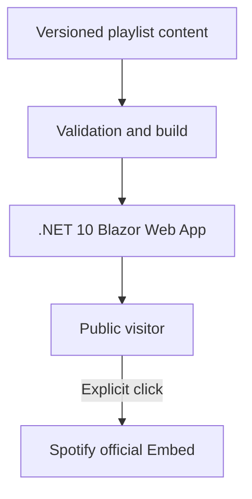

# TheBluesland — Business & Technical Specification

**Version:** 0.1
**Date:** 2 September 2026
**Status:** Draft — implementation has not started
**Repository:** GitHub, public
**Owner / curator:** Mehmet Oya

---

## 1. Executive summary

TheBluesland is a public, editorial playlist showcase for Spotify playlists curated by Mehmet Oya. It is not intended to reproduce Spotify or provide a new music catalogue. Its independent value is the human curation around each playlist: why it exists, which mood and setting it fits, and what kind of listening experience it offers.

Visitors will browse and filter playlists by mood, genre, occasion and era, read Mehmet's curator notes, and listen through Spotify's official Embed player or continue in Spotify.

The MVP will deliberately avoid a database, visitor accounts, Spotify OAuth, Spotify Web API calls and automated AI analysis. Playlist metadata used by TheBluesland will be maintained as version-controlled content in GitHub. Spotify remains responsible for displaying and updating the underlying playlist through its official Embed.

This approach minimizes cost, operational complexity and Spotify-policy risk while providing strong SEO, accessibility and social sharing.

---

## 2. Product vision

### 2.1 Vision statement

> TheBluesland is a personal music cabinet where every playlist has a mood, a story and a reason to be played.

### 2.2 Product promise

The visitor should be able to answer three questions within seconds:

1. What kind of playlist is this?
2. When or in which mood should I listen to it?
3. How can I start listening on Spotify?

### 2.3 Independent value

TheBluesland adds value beyond the Spotify player through:

- Original curator notes written by Mehmet.
- A consistent mood, genre, occasion and era taxonomy.
- Editorial collections and featured selections.
- A focused, personal visual identity.
- Shareable and searchable playlist detail pages.

---

## 3. Goals and success criteria

### 3.1 MVP goals

- Publish a fast, responsive and publicly accessible playlist showcase.
- Let visitors filter playlists by editorial tags without signing in.
- Give every playlist a permanent, shareable detail URL.
- Keep playlist management simple enough to perform through a GitHub pull request.
- Use Spotify's official Embed rather than reproducing playlist contents.
- Establish a clean .NET codebase suitable for continued development in a public repository.

### 3.2 Initial success criteria

- At least 8 editorially completed playlists at public launch.
- Every published playlist has a curator note and at least one mood, genre and occasion tag.
- Core pages achieve Lighthouse targets defined in section 15.
- A new playlist can be added without a database migration or application-code change.
- CI rejects invalid or incomplete playlist content.
- No Spotify credential or AI provider key is required in the MVP.

### 3.3 Non-goals for MVP

- Importing or analysing Spotify track lists.
- Automatically inferring mood, genre, tempo, energy or valence.
- Recommending individual tracks.
- Visitor login, profiles or saved favourites.
- Comments, reactions, ratings or voting.
- Allowing other users to submit their playlists.
- Editing Spotify playlists from TheBluesland.
- Full-text track or artist search.
- A native mobile application.
- Monetisation or advertising.

---

## 4. Target audience and use cases

### 4.1 Primary audience

Music listeners who trust personal curation and want a playlist appropriate for a particular mood, time or setting.

### 4.2 Secondary audience

- People arriving from Mehmet's blog or social media posts.
- Blues, rock, soul, jazz and adjacent-genre listeners.
- Recruiters and developers viewing the project as a public .NET portfolio repository.

### 4.3 Core user journeys

#### Journey A — Browse by mood

1. Visitor lands on the home page.
2. Visitor selects one or more mood filters.
3. Matching playlist cards remain visible.
4. Visitor opens a playlist detail page.
5. Visitor reads the curator note and loads the Spotify player.

#### Journey B — Arrive through a shared link

1. Visitor opens a playlist detail URL from social media.
2. The page immediately communicates the playlist's character and intended setting.
3. Visitor chooses either "Listen here" or "Open in Spotify".

#### Journey C — Explore related playlists

1. Visitor finishes reviewing one playlist.
2. The page displays up to three related playlists based on shared editorial tags.
3. Visitor continues browsing without returning to the home page.

---

## 5. Information architecture

| Route | Purpose | Rendering |
|---|---|---|
| `/` | Brand introduction, featured playlists, complete catalogue and filters | Static SSR + interactive filter island |
| `/playlists/{slug}` | Curator note, editorial tags, Spotify Embed and related playlists | Static SSR |
| `/collections/{slug}` | Editorial grouping such as "Late Night Blues" | Static SSR; optional for launch |
| `/about` | Mehmet's curation approach and TheBluesland story | Static SSR |
| `/privacy` | Privacy and Spotify Embed disclosure | Static SSR |
| `/terms` | Site terms and Spotify attribution/disclaimer | Static SSR |
| `/sitemap.xml` | Search-engine discovery | Server-generated |
| `/robots.txt` | Crawler policy | Static |
| `/feed.xml` | Newly published playlist feed | Server-generated; optional for launch |

There will be no `/login`, `/admin` or public API route in the MVP.

---

## 6. MVP functional requirements

### 6.1 Catalogue and cards

**FR-001 — Playlist catalogue**
The home page must list every published playlist ordered by `displayOrder`, then by `publishedAt` descending.

**FR-002 — Playlist card**
Each card must display the title, short summary, primary mood, primary genre, optional era and a clear detail-page link.

**FR-003 — Featured playlists**
The home page must support a manually curated featured section. A maximum of four playlists may be featured at once.

**FR-004 — Empty state**
If no playlists match the active filters, the page must explain this and offer a one-action filter reset.

### 6.2 Filtering

**FR-010 — Filter dimensions**
Visitors must be able to filter by mood, genre, occasion and era.

**FR-011 — Filter combination**
Values inside the same dimension use OR logic. Different dimensions use AND logic.

Example: `mood = calm OR melancholic` together with `occasion = night-drive` returns playlists that match at least one selected mood and the selected occasion.

**FR-012 — Shareable state**
Active filters must be represented in the query string so filtered views can be shared and browser navigation works correctly.

**FR-013 — Progressive enhancement**
Catalogue browsing and playlist detail pages must remain usable when JavaScript or the interactive Blazor connection is unavailable. Instant client interaction may degrade to a normal page request.

### 6.3 Playlist detail

**FR-020 — Stable URL**
Each playlist must have a unique immutable slug after publication. A changed slug requires a permanent redirect from the previous slug.

**FR-021 — Curator note**
The detail page must display an original curator note written by Mehmet. The recommended length is 80–250 words.

**FR-022 — Spotify listening actions**
The page must provide:

- A click-to-load Spotify Embed.
- A visible "Open in Spotify" link.
- Clear Spotify attribution.

**FR-023 — Related playlists**
The page must display up to three published playlists with the strongest overlap in manually assigned tags. The current playlist must never be included.

**FR-024 — Missing or removed playlist**
If a playlist is unavailable on Spotify, TheBluesland must continue displaying its editorial page and show a graceful player-unavailable message. It must not expose a broken iframe as the only content.

### 6.4 Sharing and discovery

**FR-030 — Metadata**
Every indexable page must have a unique title, description, canonical URL, Open Graph metadata and Twitter/X card metadata.

**FR-031 — Social image**
Playlist pages must use a TheBluesland-owned social card rather than downloading or permanently copying Spotify cover art.

**FR-032 — Structured data**
The site must emit valid `WebSite`, `CollectionPage` and `BreadcrumbList` schema where applicable. The MVP must not publish a copied track list in structured data.

---

## 7. Initial content inventory

The supplied links contain two unique public playlist identifiers. The first link was provided twice.

| Spotify playlist ID | Editorial title | Mood/genre tags | Curator note | Status |
|---|---|---|---|---|
| `0iJt9LMebhOY0KSHSJw3cS` | TBD by Mehmet | TBD by Mehmet | TBD by Mehmet | Candidate |
| `2m8X8fsMWor8A5AnmOHwzy` | TBD by Mehmet | TBD by Mehmet | TBD by Mehmet | Candidate |

No title, genre or mood will be inferred automatically from Spotify content.

### 7.1 Launch content requirement

The recommended public launch threshold is eight completed playlists. Development may begin with the two candidates above, but the home-page design must be evaluated again with at least eight realistic entries before release.

---

## 8. Editorial taxonomy

The taxonomy is owned by TheBluesland and must be manually assigned. Values are stable identifiers; display labels may later be localised.

### 8.1 Proposed mood vocabulary

- `melancholic`
- `calm`
- `dark`
- `warm`
- `energetic`
- `romantic`
- `reflective`
- `hopeful`
- `raw`
- `nostalgic`

### 8.2 Proposed genre vocabulary

- `blues`
- `blues-rock`
- `delta-blues`
- `electric-blues`
- `soul`
- `rock`
- `roots-rock`
- `jazz`
- `folk`
- `americana`
- `instrumental`

### 8.3 Proposed occasion vocabulary

- `late-night`
- `night-drive`
- `sunday-morning`
- `working`
- `reading`
- `rainy-day`
- `road-trip`
- `slow-evening`
- `pre-concert`
- `headphones`

### 8.4 Era vocabulary

- `pre-1960`
- `1960s`
- `1970s`
- `1980s`
- `1990s`
- `2000s`
- `2010s`
- `2020s`
- `mixed-era`

Before implementation, Mehmet will approve, remove or rename these values. Once content is published, identifiers should remain stable even if their user-facing labels change.

---

## 9. Content model

Each playlist will be stored as one Markdown file with YAML front matter.

### 9.1 Required fields

| Field | Type | Rules |
|---|---|---|
| `schemaVersion` | integer | Must equal the currently supported content schema version |
| `slug` | string | Lowercase kebab-case and globally unique |
| `spotifyPlaylistId` | string | Exactly 22 base62 characters |
| `title` | string | 3–80 characters; editorially confirmed |
| `summary` | string | 40–180 characters |
| `moods` | string array | 1–5 approved values |
| `genres` | string array | 1–5 approved values |
| `occasions` | string array | At least one approved value |
| `era` | string | One approved era value |
| `publishedAt` | ISO date | Required for published content |
| `status` | enum | `draft` or `published` |
| Markdown body | Markdown | Original curator note; required for published content |

### 9.2 Optional fields

| Field | Type | Rules |
|---|---|---|
| `featured` | boolean | Defaults to false |
| `displayOrder` | integer | Defaults to 0 |
| `accentColor` | string | Approved design token only; arbitrary CSS is forbidden |
| `previousSlugs` | string array | Used to generate permanent redirects |
| `locale` | string | Reserved for future localisation |
| `editorialUpdatedAt` | ISO date | Changes only when TheBluesland editorial content changes |

### 9.3 Validation behavior

- Invalid published content must fail CI.
- Unknown taxonomy values must fail CI.
- Duplicate slugs and duplicate Spotify playlist IDs must fail CI.
- Draft content may omit publication date but must still have a valid playlist ID and slug.
- Markdown must be sanitised; raw HTML is disabled by default.

---

## 10. Visual and editorial direction

### 10.1 Brand character

TheBluesland should feel like a late-night record room rather than a Spotify clone: intimate, editorial, textured and calm.

### 10.2 Visual principles

- Dark-first design with high-contrast readable typography.
- Warm off-white text rather than pure white.
- Deep navy, charcoal and muted electric-blue foundations.
- One warm accent such as amber, rust or aged gold.
- Subtle grain or paper texture implemented as a lightweight owned asset.
- No unlicensed artist photography.
- No Spotify-green-dominated visual identity.
- Motion must be restrained and respect `prefers-reduced-motion`.

### 10.3 Writing style

- First-person curator voice.
- Concrete listening situations instead of generic promotional language.
- No unsupported claims about artists, genres or musical characteristics.
- AI-generated text must never be published without Mehmet's review, even for future permitted use cases.

---

## 11. Spotify policy boundary

### 11.1 Allowed MVP behavior

- Store the playlist ID and TheBluesland's original editorial content.
- Render Spotify's official Embed for the playlist.
- Link back to the corresponding Spotify playlist.
- Use Spotify attribution according to its branding requirements.

### 11.2 Explicitly prohibited project behavior

- Sending Spotify playlist, track, artist, album, cover-art or metadata content to an AI/ML model.
- Automatically analysing Spotify content to derive mood, genre, popularity or listener profiles.
- Scraping Spotify pages.
- Reproducing or maintaining an independent permanent database of playlist tracks.
- Downloading audio or preview clips.
- Presenting TheBluesland as affiliated with or endorsed by Spotify.
- Using "Spotify" or a confusing Spotify-derived mark in the product name.

### 11.3 Embed privacy behavior

The Spotify iframe should be click-to-load by default. Until the visitor chooses to load it, the browser must not contact Spotify from that component. The placeholder must explain that loading the player connects to Spotify and may allow Spotify to process browser data under its own policies.

---

## 12. Technical architecture

### 12.1 Architecture decision

The MVP will be a small modular .NET application, not a distributed system. There is no separate API, database, ingest worker or message broker.



### 12.2 Runtime stack

| Concern | Technology |
|---|---|
| Runtime | .NET 10 LTS |
| Web framework | ASP.NET Core Blazor Web App |
| Default rendering | Static server-side rendering |
| Interactive UI | Interactive Server only where necessary |
| Markdown | Markdig |
| YAML front matter | YamlDotNet |
| Styling | Tailwind CSS 4 plus CSS custom properties |
| Logging | `Microsoft.Extensions.Logging` structured logs |
| Health | ASP.NET Core health checks |
| Unit tests | xUnit + Shouldly |
| Browser tests | Microsoft Playwright for .NET |
| Container | Official ASP.NET Core Linux runtime image, non-root |
| CI/CD | GitHub Actions |
| Hosting | Azure Container Apps |

### 12.3 Render-mode rules

- Public page content and SEO metadata must be present in the initial HTML response.
- The entire application must not be globally interactive.
- Only the filter component and other clearly justified UI islands may use Interactive Server.
- A lost SignalR connection must not prevent navigation or access to playlist content.

### 12.4 Spotify integration

The application constructs an Embed URL only from a validated playlist ID:

`https://open.spotify.com/embed/playlist/{spotifyPlaylistId}`

The application must not accept arbitrary iframe URLs from content files. This prevents content injection and keeps the Content Security Policy narrow.

### 12.5 Repository structure

```text
TheBluesland/
├── .github/
│   ├── workflows/
│   │   ├── ci.yml
│   │   └── deploy.yml
│   └── dependabot.yml
├── content/
│   └── playlists/
├── docs/
│   ├── adr/
│   ├── business-technical-specification.md
│   └── content-guide.md
├── src/
│   └── TheBluesland.Web/
│       ├── Components/
│       ├── Features/
│       │   └── Playlists/
│       ├── Content/
│       ├── Seo/
│       ├── wwwroot/
│       └── TheBluesland.Web.csproj
├── tests/
│   ├── TheBluesland.UnitTests/
│   └── TheBluesland.E2ETests/
├── Directory.Build.props
├── Directory.Packages.props
├── Dockerfile
├── LICENSE
├── README.md
└── TheBluesland.slnx
```

One production project is sufficient for the MVP. New projects or layers must only be introduced when they create a real dependency boundary; Clean Architecture ceremony is not a goal by itself.

---

## 13. Security and privacy requirements

**SEC-001 — No application secrets**
The MVP must not require Spotify client credentials or AI API keys.

**SEC-002 — Content Security Policy**
CSP must default to self-hosted resources and allow Spotify only in the minimum directives required for the click-to-load Embed. Inline script exceptions require a nonce or hash.

**SEC-003 — User-supplied content**
Markdown raw HTML is disabled. Rendered Markdown is sanitised before output.

**SEC-004 — iframe restrictions**
Embed markup and permissions must follow Spotify's official guidance. Playlist IDs are validated; arbitrary HTML and arbitrary iframe sources are rejected.

**SEC-005 — Headers**
Production responses must set appropriate CSP, `X-Content-Type-Options`, `Referrer-Policy`, `Permissions-Policy` and frame-related protections without blocking the intentional Spotify child iframe.

**SEC-006 — Dependencies**
Dependabot must monitor NuGet, GitHub Actions and npm/Tailwind build dependencies.

**SEC-007 — Privacy**
TheBluesland must not add analytics, ad pixels or cross-site tracking in the MVP. Server logs must not retain unnecessary query strings or personal identifiers.

---

## 14. SEO requirements

- Server-render unique title, description, canonical URL and social metadata.
- Generate `sitemap.xml` from published content only.
- Exclude drafts and filter query-string combinations from indexing.
- Canonicalise filtered catalogue views to the base catalogue unless a future editorial landing page explicitly warrants indexing.
- Use permanent redirects for old playlist slugs.
- Generate owned 1200×630 social cards using TheBluesland branding and editorial text.
- Do not hotlink Spotify cover art into social images.
- Include meaningful heading hierarchy and visible breadcrumb navigation on detail pages.

---

## 15. Performance and accessibility targets

### 15.1 Performance budgets

Measured on a representative mobile profile in production:

- Lighthouse Performance: at least 90.
- Lighthouse SEO: at least 95.
- Lighthouse Accessibility: at least 95.
- Largest Contentful Paint: target under 2.5 seconds at the 75th percentile.
- Cumulative Layout Shift: target below 0.1.
- Initial JavaScript must not include the Spotify iframe or its resources before visitor consent.
- Below-the-fold Spotify Embeds must be lazy loaded.

### 15.2 Accessibility

- Meet WCAG 2.2 AA for the MVP interface.
- All functionality must be keyboard accessible.
- Focus indicators must remain visible.
- Filter controls must expose names, states and result-count updates to assistive technology.
- Colour must not be the only way a tag or selected state is communicated.
- Text contrast must meet AA requirements.
- Reduced-motion preference must be respected.
- Spotify player limitations outside TheBluesland's control must be disclosed when relevant.

---

## 16. Reliability, errors and observability

### 16.1 Failure behavior

- Missing content directory: application startup fails with an actionable error outside production build; CI must catch it earlier.
- Invalid content: CI and build fail; invalid entries are never silently skipped.
- Spotify Embed unavailable: page remains useful and displays the external Spotify link.
- Interactive filtering unavailable: page navigation and server-rendered catalogue remain usable.

### 16.2 Observability

- Structured startup, content-load and unhandled-error logs.
- `/health/live` for process health.
- `/health/ready` verifies that playlist content loaded and passed validation.
- Do not log curator-note bodies or visitor-identifying data unnecessarily.
- Application Insights/OpenTelemetry is deferred until operational need justifies it.

---

## 17. Testing strategy

### 17.1 Unit tests

- Content schema validation.
- Spotify playlist ID validation.
- Duplicate slug and playlist-ID detection.
- Taxonomy validation.
- Published/draft selection.
- Filter OR/AND semantics.
- Related-playlist scoring and deterministic tie-breaking.
- Canonical and Embed URL generation.
- Previous-slug redirect mapping.

### 17.2 Integration/component tests

- Markdown parsing and sanitisation.
- Page metadata generation.
- Sitemap contains published content and excludes drafts.
- Security headers and CSP.
- Health endpoint behavior with valid and invalid content.

### 17.3 End-to-end tests

- Home page loads and lists published playlists.
- Filters update results and query string.
- Shared filtered URL restores the same state.
- Playlist detail is reachable by keyboard.
- Spotify iframe is absent before consent and added after explicit click.
- "Open in Spotify" points to the expected playlist.
- No-results reset flow works.
- Mobile and desktop smoke tests.

E2E tests must not depend on successful Spotify playback. They verify TheBluesland's embed boundary and fallback behavior, not Spotify's internal application.

---

## 18. CI/CD and release process

### 18.1 Pull-request CI

Every pull request must run:

1. Restore with locked dependencies.
2. Build in Release mode with warnings treated according to repository policy.
3. Content validation.
4. Unit and integration tests.
5. Code formatting verification.
6. Tailwind production build.
7. Playwright smoke tests.
8. Dependency and secret scanning available to the public GitHub repository.
9. Docker image build.

### 18.2 Deployment

- `main` is protected and deployable.
- Production deployment occurs only after all required checks pass.
- GitHub Actions builds an immutable Docker image identified by commit SHA.
- Azure Container Apps receives the immutable image.
- Deployment performs a readiness check before traffic is shifted.
- Rollback uses the previously healthy container revision.

### 18.3 Content publication workflow

1. Add or edit a Markdown file on a feature branch.
2. Preview locally.
3. Open a pull request.
4. CI validates content and application behavior.
5. Merge to `main`.
6. Deploy.

The public repository must never contain unpublished personal notes that are not intended to become visible.

---

## 19. Hosting and operational model

- Application packaged as a Linux container.
- Azure Container Apps may scale to zero for low traffic, accepting a possible cold start.
- No persistent filesystem dependency.
- All editorial content is packaged with the immutable application release.
- Custom domain and DNS are configured after the first production-ready deployment.
- HTTPS is mandatory.
- A basic uptime check may be added after launch.

The production host can be replaced later without changing the content model or application architecture.

---

## 20. Future roadmap

### V1.1 — Editorial expansion

- Editorial collection pages.
- English/Turkish localisation if justified.
- RSS feed if not included at launch.
- New and recently updated indicators.

### V1.2 — AI-assisted editorial writing

AI may assist only with TheBluesland-owned text supplied by Mehmet, such as an original rough curator note. It may produce a polished summary, social post or translation.

The following inputs remain forbidden:

- Spotify playlist URLs supplied for model retrieval.
- Spotify playlist contents.
- Spotify track, album or artist metadata.
- Spotify cover art or audio.

All generated text requires human review and explicit publication.

### V2 — Optional private editorial administration

Only if GitHub-based content editing becomes a measurable problem:

- Owner-only authentication.
- Draft editor and preview.
- Database-backed TheBluesland editorial content.
- Export back to repository or another durable content source.

Spotify visitor authentication, third-party playlist submissions and automated Spotify content analysis remain outside the planned roadmap.

---

## 21. Risks and mitigations

| Risk | Impact | Mitigation |
|---|---|---|
| Spotify changes Embed behavior or terms | Player may stop or policy may change | Keep editorial pages valuable without the player; isolate Embed integration; review policy periodically |
| Too few playlists at launch | Catalogue looks unfinished | Launch after at least eight completed entries; develop with realistic fixtures |
| Taxonomy becomes inconsistent | Filters lose meaning | Use controlled vocabulary and CI validation; require explicit taxonomy changes |
| Interactive Server connection fails | Filters feel broken | Preserve SSR navigation and query-string fallback |
| Spotify iframe affects privacy/performance | Third-party requests and slower pages | Click-to-load, lazy loading and clear disclosure |
| Public repo leaks private drafts | Unintended publication | Keep only publishable draft content in repo; document content workflow |
| Architecture becomes over-engineered | Slower delivery and maintenance | One production project; no database/API until a proven requirement exists |
| TheBluesland is perceived as Spotify-affiliated | Branding/policy issue | Independent visual language, clear attribution and disclaimer |

---

## 22. Definition of Done for MVP

The MVP is complete when:

- At least eight playlists are editorially complete and published.
- All functional requirements marked for MVP are implemented.
- Taxonomy is approved and enforced by validation.
- Home, detail, about, privacy and terms pages are complete.
- Spotify Embed is click-to-load with a working Spotify fallback link.
- SEO metadata, sitemap and owned social cards are verified.
- WCAG and performance targets have been tested on representative pages.
- Unit, integration and E2E test suites pass in CI.
- Docker image runs as a non-root user and health checks pass.
- Production deployment and rollback have both been exercised.
- README contains local setup, content-authoring and deployment instructions.
- No Spotify or AI credential is required or present.

---

## 23. Decisions required before implementation

The following items remain deliberately open:

1. **Primary language:** Turkish, English, or a single-language English MVP with localisation later.
2. **Approved taxonomy:** confirm, remove or rename the proposed mood, genre, occasion and era values.
3. **Initial playlist content:** provide the editorial title, summary, tags and curator note for each supplied playlist.
4. **Launch inventory:** select at least six additional playlists.
5. **Domain:** choose the production domain after checking availability and trademark/branding suitability.
6. **Visual direction:** approve one moodboard before UI implementation.

Implementation must not begin until items 1–3 are resolved. Items 4–6 may proceed in parallel with the initial scaffold after the specification is approved.

---

## 24. Recommended ADRs

- **ADR-001:** Use Spotify Embed instead of Spotify Web API in MVP.
- **ADR-002:** Do not send Spotify Content to AI/ML systems.
- **ADR-003:** Store TheBluesland editorial content as version-controlled Markdown.
- **ADR-004:** Use .NET 10 Blazor static SSR with isolated interactivity.
- **ADR-005:** Start with one deployable application and no database.
- **ADR-006:** Require click-to-load for third-party Spotify content.

These ADRs should be created from the approved decisions rather than copied mechanically before review.

---

## 25. Primary references

- Spotify Developer Policy: <https://developer.spotify.com/policy>
- Spotify Developer Terms: <https://developer.spotify.com/terms>
- Spotify Embeds overview: <https://developer.spotify.com/documentation/embeds>
- Spotify Embed creation guide: <https://developer.spotify.com/documentation/embeds/tutorials/creating-an-embed>
- Spotify February 2026 Development Mode migration guide: <https://developer.spotify.com/documentation/web-api/tutorials/february-2026-migration-guide>
- Spotify February 2026 Web API changelog: <https://developer.spotify.com/documentation/web-api/references/changes/february-2026>
- .NET support policy: <https://dotnet.microsoft.com/en-us/platform/support/policy/dotnet-core>
